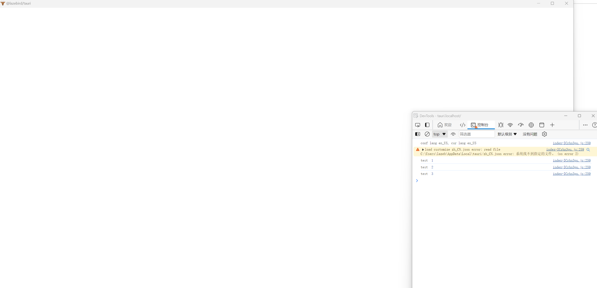
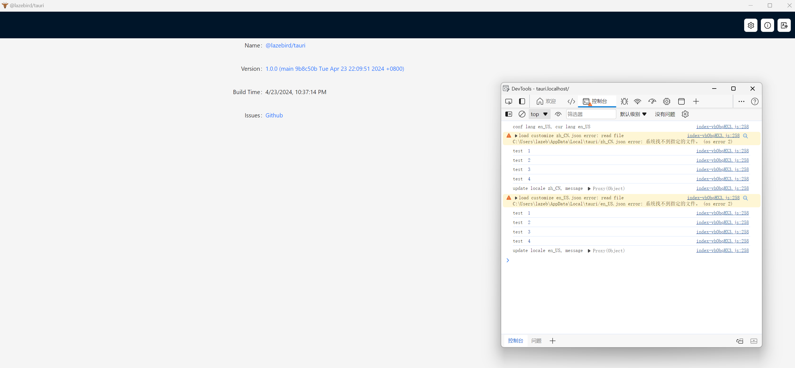

# @lazebird/tauri

## 介绍
- 本项目用于定位和记录一个tauri app在Windows上白屏的问题
- 调试发现`src\store\locale.ts:44`导入中文语言存在问题，会卡死导致页面白屏
- 调试版本可以通过`pnpm tauri build --debug`进行编译，运行时右键可以打开开发者工具并查看调试日志

# 截图
## 故障

## 正常

